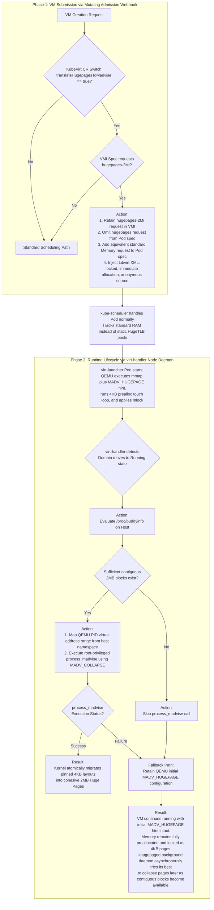

# KubeVirt Hugepage Translation Approach

**Goal:**
Deliver intent-based memory allocation. Users request hugepages. Platform decides whether to use static HugeTLB or transparent hugepages (THP) with preallocation and mlock.

**The Problem:**
* Static hugepages require rigid node partitioning.
* Runtime fallback (waiting for Pod `Pending` state to timeout) breaks Kubernetes immutability. You can't change pod resource requests on the fly.

**The Solution (Translation at Submission):**
* **Cluster Switch:** Add `translateHugepagesToMadvise: true` to the KubeVirt CR.
* **Intercept:** Mutating Admission Webhook catches the VM creation request.
* **Translate Pod:** Retain the `hugepages-2Mi` request in the VMI for tracking user intent, but omit it from the generated Pod specification. Replace it in the Pod spec with an equivalent standard `memory` request so `kube-scheduler` handles it normally.
* **Inject XML:** Configure the system to inject the following Libvirt XML:
  * `<locked/>` (mlock)
  * `<allocation mode='immediate'/>` (prealloc)
  * `<source type='anonymous'/>` (THP trigger)

**Why preallocation is critical for THP:**
* **Beat Fragmentation:** `mmap` and `madvise` are lazy. Preallocation forces the kernel to allocate 2MB blocks immediately at boot when memory is cleanest, rather than relying on runtime page faults when the node is already fragmented.
* **Dense Mapping:** Touching every 4KB page boundary prevents partial mappings. It guarantees the entire 2MB block is fully populated and backed by physical RAM with zero lazy allocation overhead.
* **Decouple Lock Contention:** Populating physical pages via a touch loop first prevents the kernel from choking on lock contention if it tries to allocate and `mlock` raw virtual ranges under a single heavy lock context.

**Why mlock is critical for THP:**
* **Anti-Splitting:** Prevents the kernel from splitting pristine 2MB pages back to 4KB pages under heavy host memory pressure.
* **TLB Anchor:** Permanently pins the physical-to-virtual path. Keeps high-value 2MB TLB cache entries completely hot.
* **Kill Background Stalls:** Forces immediate materialization at allocation. Removes the memory region from `khugepaged` scanning, wiping out background daemon CPU jitter.

**Smart Fallback and Collapse via Node Handler (virt-handler):**
* **Zero Pod Overhead:** Eliminates pod-level sidecars, user-facing annotations, and the need to give user pods `CAP_SYS_NICE` privileges.
* **Lifecycle Watch:** `virt-handler` monitors domain events on the host node. When a VM moves to the `Running` state, it hooks into the initialization sequence.
* **Buddyinfo Evaluation:** `virt-handler` checks `/proc/buddyinfo` on the host to verify contiguous 2MB blocks exist.
* **If available:** `virt-handler` maps the QEMU PID address range from the host namespace and triggers `process_madvise(MADV_COLLAPSE)` using its native host root privileges.
* **If unavailable or fails:** `virt-handler` skips or exits the `process_madvise` call. QEMU retains its initial `MADV_HUGEPAGE` hint configuration. The memory remains fully preallocated and locked as 4KB pages, and the `khugepaged` background daemon asynchronously tries its best to collapse the blocks later as memory frees up.

**Why this works:**
* Clean UX. Users just ask for hugepages without tracking infrastructure changes or capabilities.
* Zero custom scheduling logic in KubeVirt. `kube-scheduler` tracks standard RAM.
* Smooth live migrations (standard RAM vs rigid HugeTLB pools).

## Decision Flow Diagram

